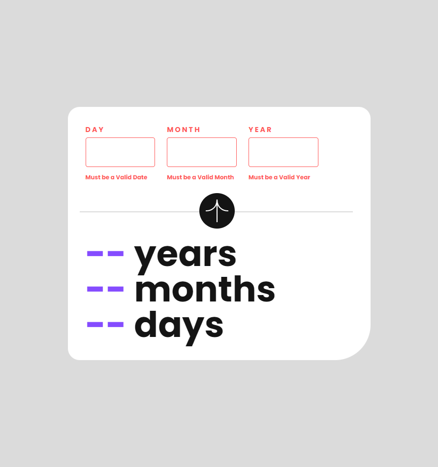
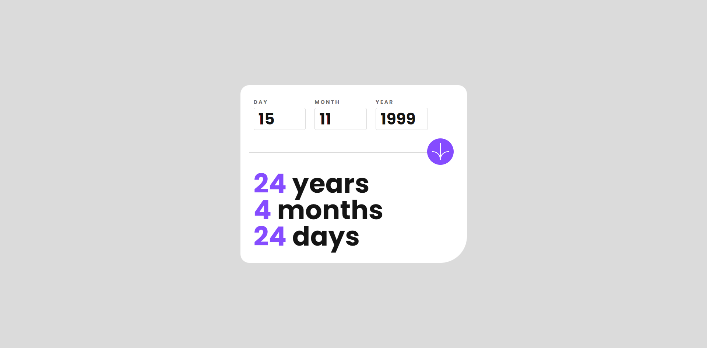

# Frontend Mentor - Age calculator app solution

This is a solution to the [Age calculator app challenge on Frontend Mentor](https://www.frontendmentor.io/challenges/age-calculator-app-dF9DFFpj-Q).

## Table of contents

- [Frontend Mentor - Age calculator app solution](#frontend-mentor---age-calculator-app-solution)
  - [Table of contents](#table-of-contents)
  - [Overview](#overview)
    - [The challenge](#the-challenge)
    - [Screenshot](#screenshot)
  - [Mobile Preview](#mobile-preview)
  - [Desktop Preview](#desktop-preview)
    - [Links](#links)
  - [My process](#my-process)
    - [Built with](#built-with)
    - [Useful resources](#useful-resources)
  - [Author](#author)

**Note: Delete this note and update the table of contents based on what sections you keep.**

## Overview

### The challenge

Users should be able to:

- View an age in years, months, and days after submitting a valid date through the form
- Receive validation errors if:
  - Any field is empty when the form is submitted
  - The day number is not between 1-31
  - The month number is not between 1-12
  - The year is in the future
  - The date is invalid e.g. 31/04/1991 (there are 30 days in April)
- View the optimal layout for the interface depending on their device's screen size
- See hover and focus states for all interactive elements on the page
- **Bonus**: See the age numbers animate to their final number when the form is submitted

### Screenshot

## Mobile Preview

## Desktop Preview

### Links

- Solution URL: [Click Here](https://www.frontendmentor.io/solutions/age-calculator-app-XmgvWMgEvc)
- Live Site URL: [Click Here](https://karthikyerra1.github.io/age-calculator-app/)

## My process

### Built with

- CSS custom properties
- Flex box
- Mobile-first workflow
- [React](https://reactjs.org/) - JS library
- [Vite](https://vite.dev/) - Package Bundler

### Useful resources

- [date-fns package](https://date-fns.org/docs/Getting-Started) - This helped me to simplify the project code to calculate the age. I really liked this pattern and will use it going forward.

## Author

- Website - [Karthik Yerra]()
- Frontend Mentor - [@KarthikYerra1](https://www.frontendmentor.io/profile/KarthikYerra1)
